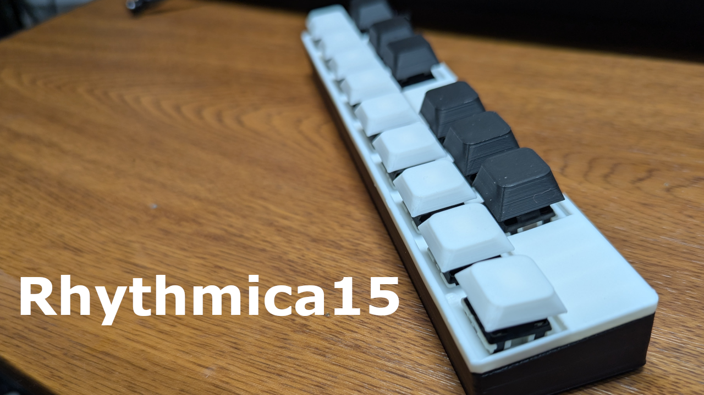
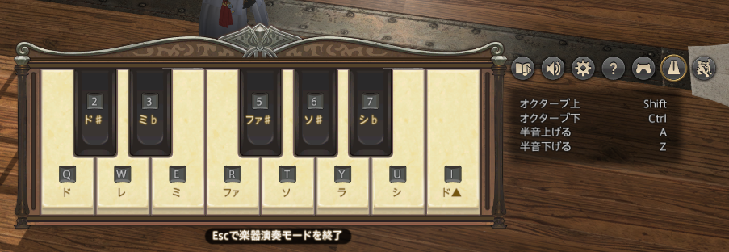
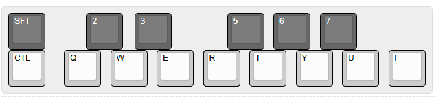
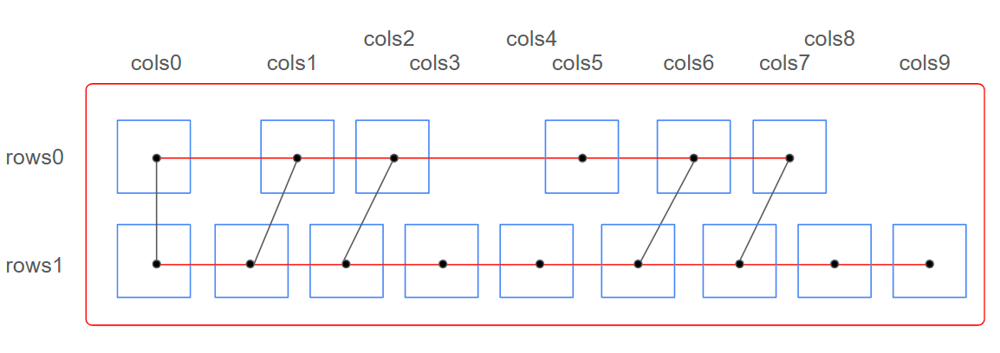
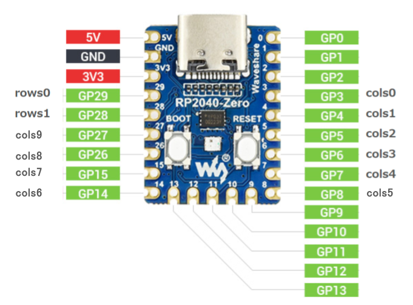
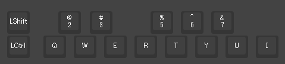
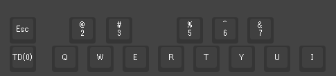
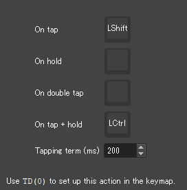

# Rhythmica15
This is a homemade macro pad specifically designed for playing with the Bard job in FINAL FANTASY XIV.

---

## Overview

It was created to make in-game performance more comfortable by adopting the same key layout as in the game. To reproduce the difference in height between white and black keys, keycaps with different profiles are used.

<blockquote class="twitter-tweet" data-media-max-width="560">
自作キーボードで「そして世界へ」を練習していました。 危うい手つきで頑張っています！ 一番左下のボタンはShiftキーを割り当てていますが、1回タップした後長押しするとCtrlキーになり、半音下がるようにしています。<a href="https://twitter.com/hashtag/%E8%87%AA%E4%BD%9C%E3%82%AD%E3%83%BC%E3%83%9C%E3%83%BC%E3%83%89?src=hash&amp;ref_src=twsrc%5Etfw">#自作キーボード</a> <a href="https://twitter.com/hashtag/FFXIV?src=hash&amp;ref_src=twsrc%5Etfw">#FFXIV</a> <a href="https://twitter.com/hashtag/FF14?src=hash&amp;ref_src=twsrc%5Etfw">#FF14</a> <a href="https://twitter.com/hashtag/CustomKeyboard?src=hash&amp;ref_src=twsrc%5Etfw">#CustomKeyboard</a> <a href="https://t.co/cwKdLyWgvy">pic.twitter.com/cwKdLyWgvy</a>
&mdash; モゲ三郎 (@Moge313101) <a href="https://twitter.com/Moge313101/status/1948987830791012719?ref_src=twsrc%5Etfw">July 26, 2025</a></blockquote> 
---

## Features

* **Game-oriented:** Optimized key layout for Bard performance in FINAL FANTASY XIV.
* **Keycaps:** Uses **DAS profile** for white keys and **XDA profile** for black keys to reproduce the step of a keyboard.
* **Key switches:** All keys use the same switch for a unified typing feel.
* **Firmware:** Compatible with **Vial**, making keymap changes easy.
* **Function:** The lower left key is assigned an octave switch (Shift/Ctrl) function using **Tap Dance**.

---

## Specifications

* **Number of keys:** 15
* **MCU:** RP2040-Zero
* **Key switches:** EPOMAKER Zebra 40gf linear mechanical keyboard switches
* **Keycaps:** DAS profile (white keys), XDA profile (black keys)
* **Size:** 204mm * 42mm * 20mm 

### In-game key layout

### Rhythmica15 keymap

---

## Parts List
* 1 x RP2024-Zero
* 15 x diodes 1N4148
* 15 x Mechanical switches
* 6 x XDA Profile keycaps of choice
* 9 x DAS Profile keycaps of choice
* 24 AWG wire
* 6 x M2x3x3.2 OD heat inserts
* 6 x M2x10 Allen head screws
* Enameled wire 0.6mm 16cm
* 3D Print Parts 
  **Data Thingiverse** 
[https://www.thingiverse.com/thing:7102121](https://www.thingiverse.com/thing:7102121)

## Build Instructions

### 1. Print the top and bottom parts created with 3D CAD using a 3D printer.
Parts can be downloaded from the following Thingiverse page.

[https://www.thingiverse.com/thing:7102121](https://www.thingiverse.com/thing:7102121)

### 2. Install the key switches into the top part.

### 3. Wire the key switches and MCU (RP2040-Zero) by hand.
Wire as shown below.

### 4. The top case is the back side, so it is the reverse of the diagram above.
Attach the lead wires and diodes.
In the photo below, the heat inserts are also attached.

Pay attention to the direction of the diodes. The orientation of the anode and cathode is as shown in the photo below.
Solder the anode side to the switch pin.

Bend the anode side of the diode sideways and connect them.

### 5. Wiring to RP2024-Zero.
Mount the RP2024-Zero on the MCU mount on the left side of the top case.

Wire to the cols (vertical) and rows (horizontal) pins of the MCU.

The wiring is a bit messy, but make sure not to make mistakes.

### 6. Write the firmware and set the keymap with Vial.
Connect the RP2024-Zero to your PC via USB, press and hold the boot switch, then press the reset switch, and release both at the same time. 
RP2024-Zero will be recognized as a drive, so write "rhythmica15_vial.uf2" from the firmware folder. 
Access the Vial site and recognize Rhythmica15. 
Check each key with Matrix tester to make sure they work properly.

### 7. Attach the top and bottom cases with screws.
After confirming normal operation, attach the top and bottom cases with six screws. 
Attach silicone anti-slip pads to the corners on the back.

### 8. Keymap confirmation
Access the Vial site and recognize Rhythmica15.
By default, the keymap is as shown in the diagram.

It may be easier to use if you set TapDance to the lower left key as shown below.

Feel free to change the settings as you like.

---

## Summary

I made this because I wanted to play in-game music as if using a real keyboard.
By using different keycap profiles, I aimed for an operation feel similar to a real piano. 
I would be happy to receive feedback.