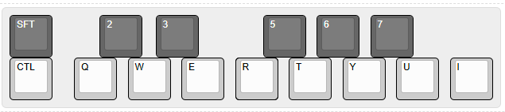
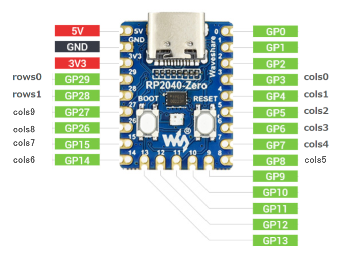
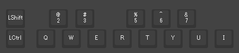
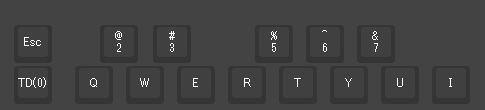
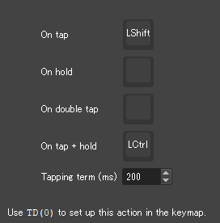

# Rhythmica15
This is a homemade macro pad specifically designed for playing with the Bard job in FINAL FANTASY XIV.

---

## 概要

ゲーム内のキーアサインと同じ配列を採用し、演奏をより快適に行うことを目的として製作されました。白鍵と黒鍵の段差を再現するため、それぞれ異なるプロファイルのキーキャップを使用しているのが特徴です。

---

## 特徴

* **ゲーム特化:** 『FINAL FANTASY XIV』の吟遊詩人ジョブの演奏に最適なキー配列。
* **キーキャップ:** 白鍵に**DASプロファイル**、黒鍵に**XDAプロファイル**のキーキャップを採用し、鍵盤の段差を再現。
* **キースイッチ:** 打鍵感を統一するため、すべてのキーに同じキースイッチを使用。
* **ファームウェア:** **Vial**に対応しており、キーマップの変更が容易。
* **機能:** 左下のキーに**Tap Dance**でオクターブ切り替え（Shift/Ctrl）機能を割り当て。

---

## 仕様

* **キー数:** 15キー
* **MCU:** RP2040-Zero
* **キースイッチ:** EPOMAKER Zebra 40gfリニアメカニカルキーボードスイッチ
* **キーキャップ:** DASプロファイル（白鍵）、XDAプロファイル（黒鍵）
* **サイズ:** 204mm * 42mm * 20mm 

### ゲームの内のキー配列

### Rhythmica15のキーマップ

---

## 部品一覧
* 1 x RP2024-Zero
* 15 x diodes 1N4148
* 15 x Mechanical switches
* 6 x XDA Profile keycaps of choice
* 9 x DAS Profile keycaps of choice
* 24 AWG wire
* 6 x M2x3x3.2 OD heat inserts
* 6 x M2x10 Allen head screws
* Enameled wire 0.6mm 16cm
* 3D Print Parts 
  **Data Thingiverse** 
[https://makerworld.com/ja/models/1702596-rhythmica15#profileId-1805689](https://makerworld.com/ja/models/1702596-rhythmica15#profileId-1805689)

## ビルド方法

### 1.  3D CADで作成したトップパーツとボトムパーツを3Dプリンターで出力します。
パーツはThingiverseの下記のページからダウンロードできます。

[https://www.thingiverse.com/thing:7102121](https://www.thingiverse.com/thing:7102121)

### 2.  トップパーツにキースイッチを取り付けます。

### 3.  キースイッチとMCU（RP2040-Zero）をハンドワイヤーで配線します。
配線は下記のように配線します。

### 4.  トップケースは裏面なので、上記の図とは反対になっています。
リード線とダイオードを取り付けます。
下の写真ではついでにヒートインサーとも取り付けてます。

ダイオードの向きに注意してください。アノードとカノードの向きは下の写真のようになっています。
アノード側をスイッチのピンにはんだで取り付けます。

ダイオードのアノード側を横に折り曲げて、繋げていきます。

### 5.  RP2024-Zeroに配線してます。
トップケースの左側にあるMCUのマウントにRP2024-Zeroを取っ付けます。

cols(縦)とrows横の列のMCUに配線していきます。

ちょっと雑な配線になっていますが、間違えないように配線していきます。

### 6.  ファームウェアを書き込み、Vialでキーマップを設定します。
RP2024-ZeroをUSBでパソコンに接続し、bootスイッチを押しながら、resetスイッチを押して、同時に離します。 
すると、RP2024-Zeroがドライブとして認識しますので、firmwareフォルダ内にある「rhythmica15_vial.uf2」を書き込んでください。 
vialをサイトにアクセスし、Rhythmica15を認識させます。 
各キーが正常に動作するかMatrix testerを使って確認してください。

### 7.トップケースとボトムケースをネジで取り付けます。
正常に動作することを確認してから6つのネジでトップケースとボトムケースを取り付けます。 
背面の隅にはシリコンの滑り止めも取り付けます。

### 8.キーマップ確認
vialをサイトにアクセスし、Rhythmica15を認識させます。
デフォルトでは図のようなキーマップになっています。

下図のようにTapDanceを左下のキーに設定した方がつい買いやすいかもしれません。

お好みで設定を変更してください。

---

## まとめ

ゲーム内の演奏をリアルな鍵盤のように操作したいという想いから製作してみました。
キーキャップのプロファイルを使い分けることで、実際のピアノのような操作感を目指しています。 
フォードバックを貰えたらうれしいです。